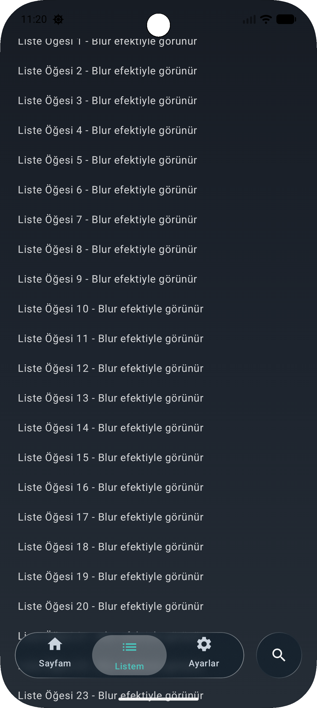
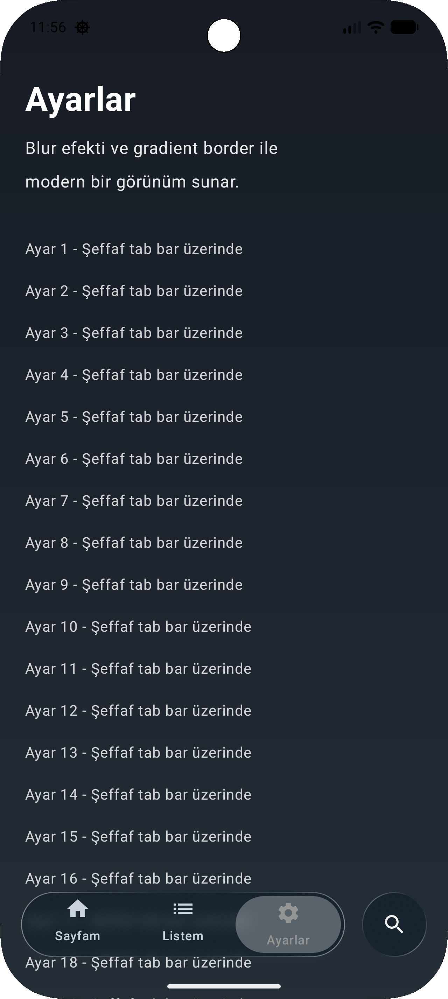

# Liquid Glass Tab Bar

<div align="center">


iOS LiquidGlassTabBar tasarımını Android Jetpack Compose'a uyarlayan, özelleştirilebilir bir tab bar kütüphanesi.

[Kurulum](#kurulum) • [Kullanım](#hızlı-başlangıç) • [Özelleştirme](#özelleştirme) • [API Referansı](#api-referansı)

</div>

---

## ✨ Özellikler

- 🎨 **iOS Tasarımına Uygun**: iOS'taki liquid glass efektini Android'de simüle eder
- 🌈 **Özelleştirilebilir**: Tüm renkler, spacing, blur ve border ayarları özelleştirilebilir
- 🔍 **Blur Efekti**: Haze kütüphanesi ile gerçekçi blur efekti
- 📱 **Modern UI**: Jetpack Compose ile modern ve performanslı UI
- 🎯 **Kolay Kullanım**: Basit ve temiz SDK API'si
- 🏗️ **SDK Ready**: Production-ready kütüphane yapısı

## 📸 Ekran Görüntüleri

<div align="center">

### Light Theme (Açık Tema)


### Dark Theme (Koyu Tema)

<table>
  <tr>
    <td align="center">
      
      <br/>
      <sub>Liste Görünümü</sub>
    </td>
    <td align="center">
      
      <br/>
      <sub>Ayarlar Tabı</sub>
    </td>
  </tr>
</table>

</div>

## 📦 Kurulum

### 🚀 SDK Olarak Kullanım (Önerilen - JitPack)

**1. Projenizin `settings.gradle.kts` (veya `settings.gradle`) dosyasına JitPack repository'sini ekleyin:**

```kotlin
dependencyResolutionManagement {
    repositoriesMode.set(RepositoriesMode.FAIL_ON_PROJECT_REPOS)
    repositories {
        google()
        mavenCentral()
        maven { url = uri("https://jitpack.io") } // JitPack ekleyin
    }
}
```

**2. Uygulamanızın `build.gradle.kts` (veya `build.gradle`) dosyasına dependency ekleyin:**

```kotlin
dependencies {
    // Liquid Glass Tab Bar kütüphanesi
    implementation("com.github.dilarakiraz:liquid-glass-tabbar:1.0.0")
    
    // Haze kütüphanesi (blur efekti için gerekli)
    implementation("dev.chrisbanes.haze:haze:1.4.0")
    
    // ... diğer dependencies
}
```

> **Not:** 
> - Haze kütüphanesi blur efekti için gereklidir. Kütüphanemiz Haze'e bağımlıdır.
> - İlk release'den sonra version tag'i oluşturmanız gerekecek. Şimdilik `main-SNAPSHOT` veya commit hash kullanabilirsiniz:
> ```kotlin
> implementation("com.github.dilarakiraz:liquid-glass-tabbar:main-SNAPSHOT")
> // veya belirli bir commit için:
> implementation("com.github.dilarakiraz:liquid-glass-tabbar:abc1234")
> ```

### 📁 Yerel Modül Olarak Kullanım

Eğer kütüphaneyi yerel olarak kullanmak istiyorsanız:

**1. Projeyi clone edin veya `liquidglass/` modülünü kopyalayın:**

```bash
git clone https://github.com/dilarakiraz/liquid-glass-tabbar.git
```

**2. settings.gradle.kts** dosyasına modülü ekleyin:

```kotlin
include(":liquidglass")
```

**3. Kendi uygulamanızın build.gradle.kts** dosyasına dependency ekleyin:

```kotlin
dependencies {
    // Liquid Glass Tab Bar modülü
    implementation(project(":liquidglass"))
    
    // Haze kütüphanesi (blur efekti için gerekli)
    implementation("dev.chrisbanes.haze:haze:1.4.0")
    
    // ... diğer dependencies
}
```

> **Not:** Haze kütüphanesi blur efekti için gereklidir. Kütüphanemiz Haze'e bağımlıdır.

## 🚀 Hızlı Başlangıç

### Temel Kullanım

```kotlin
import androidx.compose.material.icons.Icons
import androidx.compose.material.icons.filled.Home
import androidx.compose.material.icons.filled.List
import androidx.compose.material.icons.filled.Settings
import androidx.compose.material.icons.filled.Search
import androidx.compose.material3.Scaffold
import androidx.compose.runtime.getValue
import androidx.compose.runtime.mutableIntStateOf
import androidx.compose.runtime.remember
import androidx.compose.runtime.setValue
import androidx.compose.ui.graphics.Color
import com.yourpackage.liquidglass.LiquidGlassTabBar
import com.yourpackage.liquidglass.LiquidTabItem
import com.yourpackage.liquidglass.LiquidGlassStyle
import dev.chrisbanes.haze.HazeState
import dev.chrisbanes.haze.hazeSource

@Composable
fun MyScreen() {
    val hazeState = remember { HazeState() }
    var selectedTab by remember { mutableIntStateOf(0) }
    
    val tabs = listOf(
        LiquidTabItem(
            icon = Icons.Default.Home,
            label = "Ana Sayfa",
            selectedColor = Color(0xFF82DBF7),
            unselectedColor = Color(0xFFD3DCE6)
        ),
        LiquidTabItem(
            icon = Icons.Default.List,
            label = "Listem",
            selectedColor = Color(0xFF4ECDC4),
            unselectedColor = Color(0xFFD3DCE6)
        ),
        LiquidTabItem(
            icon = Icons.Default.Settings,
            label = "Ayarlar",
            selectedColor = Color(0xFF9B9B9B),
            unselectedColor = Color(0xFFD3DCE6)
        )
    )
    
    Scaffold(
        bottomBar = {
            LiquidGlassTabBar(
                items = tabs,
                selectedIndex = selectedTab,
                onTabSelected = { selectedTab = it },
                style = LiquidGlassStyle.Default,
                hazeState = hazeState,
                searchIcon = Icons.Default.Search
            )
        }
    ) { paddingValues ->
        // İçerik - ÖNEMLİ: Blur için hazeSource ekleyin
        Column(
            modifier = Modifier
                .fillMaxSize()
                .padding(paddingValues)
                .hazeSource(state = hazeState) // Blur için gerekli!
        ) {
            // İçerik buraya
        }
    }
}
```

## 🎨 Özelleştirme

### Tab Renkleri

```kotlin
val customTabs = listOf(
    LiquidTabItem(
        icon = Icons.Default.Home,
        label = "Home",
        selectedColor = Color(0xFF82DBF7),    // Seçili tab rengi
        unselectedColor = Color(0xFFD3DCE6)   // Seçili olmayan tab rengi
    )
)
```

### Style Presets

Kütüphane hazır style preset'leri sunar:

```kotlin
// iOS-style (varsayılan)
LiquidGlassTabBar(
    items = tabs,
    selectedIndex = selectedTab,
    onTabSelected = { selectedTab = it },
    style = LiquidGlassStyle.Default  // veya LiquidGlassStyle.ios()
)

// Neon-style (daha güçlü blur ve parlak border)
LiquidGlassTabBar(
    items = tabs,
    selectedIndex = selectedTab,
    onTabSelected = { selectedTab = it },
    style = LiquidGlassStyle.neon()
)

// Minimal-style (ince efektler)
LiquidGlassTabBar(
    items = tabs,
    selectedIndex = selectedTab,
    onTabSelected = { selectedTab = it },
    style = LiquidGlassStyle.minimal()
)
```

### Özel Style Oluşturma

```kotlin
val customStyle = LiquidGlassStyle(
    blurRadius = 15.dp,              // Blur radius
    backgroundAlpha = 0.9f,          // Arka plan şeffaflığı
    borderWidth = 1.dp,              // Border genişliği
    borderOpacity = 0.7f,            // Border opacity
    cornerRadius = 999.dp,           // Köşe yuvarlaklığı
    barHeight = 68.dp,               // Tab bar yüksekliği
    horizontalPadding = 24.dp,       // Yatay padding
    topPadding = 20.dp,              // Üst padding
    tabSearchSpacing = 20.dp,        // Tab ve search arası spacing
    selectedTabBackgroundAlpha = 0.4f // Seçili tab background alpha
)

LiquidGlassTabBar(
    items = tabs,
    selectedIndex = selectedTab,
    onTabSelected = { selectedTab = it },
    style = customStyle
)
```

### Label Olmadan (Sadece Icon)

```kotlin
val iconOnlyTabs = listOf(
    LiquidTabItem(
        icon = Icons.Default.Home,
        label = null,  // Label yok - sadece icon gösterilir
        selectedColor = Color(0xFF82DBF7),
        unselectedColor = Color(0xFFD3DCE6)
    )
)
```

### Search Button Olmadan

```kotlin
LiquidGlassTabBar(
    items = tabs,
    selectedIndex = selectedTab,
    onTabSelected = { selectedTab = it },
    showSearchButton = false  // Search button gizle
)
```

### HazeState Otomatik Yönetimi

`hazeState` parametresi optional'dır. Verilmezse otomatik oluşturulur:

```kotlin
// hazeState otomatik yönetiliyor
LiquidGlassTabBar(
    items = tabs,
    selectedIndex = selectedTab,
    onTabSelected = { selectedTab = it }
)

// Veya manuel olarak yönetebilirsiniz
val hazeState = remember { HazeState() }
LiquidGlassTabBar(
    items = tabs,
    selectedIndex = selectedTab,
    onTabSelected = { selectedTab = it },
    hazeState = hazeState  // Manuel yönetim
)
```

## 📚 API Referansı

### LiquidGlassTabBar

```kotlin
@Composable
fun LiquidGlassTabBar(
    items: List<LiquidTabItem>,              // Tab listesi
    selectedIndex: Int,                       // Seçili tab index
    onTabSelected: (Int) -> Unit,             // Tab seçim callback
    modifier: Modifier = Modifier,            // Compose modifier
    style: LiquidGlassStyle = LiquidGlassStyle.Default,  // Style configuration
    onSearchClick: () -> Unit = {},          // Search button callback
    showSearchButton: Boolean = true,         // Search button göster/gizle
    searchIcon: ImageVector? = null,          // Search button icon
    hazeState: HazeState? = null              // HazeState (optional - otomatik oluşturulur)
)
```

### LiquidTabItem

```kotlin
data class LiquidTabItem(
    val icon: ImageVector,                    // Tab ikonu (zorunlu)
    val label: String? = null,                // Tab etiketi (opsiyonel - null ise sadece icon)
    val selectedIcon: ImageVector? = null,    // Seçili durumda ikon (opsiyonel)
    val selectedColor: Color = Color(0xFF82DBF7),   // Seçili tab rengi
    val unselectedColor: Color = Color(0xFFD3DCE6)  // Seçili olmayan tab rengi
)
```

### LiquidGlassStyle

```kotlin
data class LiquidGlassStyle(
    val blurRadius: Dp = 10.dp,              // Blur radius
    val backgroundAlpha: Float = 0.95f,       // Arka plan şeffaflığı (0.0 - 1.0)
    val borderWidth: Dp = 0.75.dp,           // Border genişliği
    val borderOpacity: Float = 0.5f,          // Border opacity (0.0 - 1.0)
    val cornerRadius: Dp = 999.dp,           // Köşe yuvarlaklığı (999.dp = pill shape)
    val barHeight: Dp = 62.dp,               // Tab bar yüksekliği
    val horizontalPadding: Dp = 20.dp,       // Yatay padding
    val topPadding: Dp = 16.dp,              // Üst padding
    val tabSearchSpacing: Dp = 16.dp,        // Tab ve search arası spacing
    val selectedTabBackgroundAlpha: Float = 0.5f,  // Seçili tab background alpha
    val selectedTabBackground: Color? = null  // Seçili tab background rengi (null = auto)
) {
    companion object {
        val Default: LiquidGlassStyle = ios()
        fun ios(): LiquidGlassStyle          // iOS-style preset
        fun neon(): LiquidGlassStyle         // Neon-style preset
        fun minimal(): LiquidGlassStyle      // Minimal-style preset
    }
}
```

## ⚠️ Önemli Notlar

1. **Blur Efekti**: Blur efektinin çalışması için içeriğe `hazeSource` modifier'ını eklemelisiniz:
   ```kotlin
   Column(
       modifier = Modifier.hazeSource(state = hazeState)
   ) {
       // İçerik
   }
   ```

2. **HazeState**: `HazeState`'i `remember` ile oluşturun ve tüm ekranda aynı instance'ı kullanın. `hazeState` parametresi optional'dır - verilmezse otomatik oluşturulur.

3. **Tab Sayısı**: İstediğiniz kadar tab ekleyebilirsiniz. Search button'u gizleyerek tüm alanı tab'lara ayırabilirsiniz.

4. **Import**: Kütüphaneyi kullanmak için:
   ```kotlin
   import com.yourpackage.liquidglass.LiquidGlassTabBar
   import com.yourpackage.liquidglass.LiquidTabItem
   import com.yourpackage.liquidglass.LiquidGlassStyle
   ```

5. **Light Theme**: Açık tema için `LiquidGlassStyle`'da `borderOpacity` değerini düşürebilirsiniz:
   ```kotlin
   val lightStyle = LiquidGlassStyle(
       borderOpacity = 0.3f  // Açık temada daha ince border
   )
   ```

## 🏗️ Proje Yapısı

```
liquidglasstabbar/
├── liquidglass/              # ⭐ KÜTÜPHANE MODÜLÜ
│   └── src/main/java/com/yourpackage/liquidglass/
│       ├── LiquidGlassTabBar.kt      # Public API
│       ├── LiquidTabItem.kt           # Public API
│       ├── LiquidGlassStyle.kt        # Public API
│       ├── LiquidGlassRectangle.kt   # Internal
│       ├── LiquidGlassCircle.kt       # Internal
│       └── models/                    # Internal models
│           ├── TabItem.kt
│           ├── GlassConfig.kt
│           ├── SpacingConfig.kt
│           └── BorderGradient.kt
├── sample-app/               # 📱 Sample App (SDK örneği)
│   └── src/main/java/com/yourpackage/liquidglass/sample/
│       └── MainActivity.kt
└── app/                      # Demo uygulama (opsiyonel)
    └── src/main/java/com/dilara/liquid_glass_tabbar/
        └── MainActivity.kt
```

> **Not:** `sample-app/` modülü SDK kullanım örneği içerir. `app/` modülü demo amaçlıdır.

## 📄 Lisans

Bu proje MIT lisansı altında lisanslanmıştır. Detaylar için [LICENSE](LICENSE) dosyasına bakın.

## 👤 Yazar

**Dilara Kiraz**

- GitHub: [@dilarakiraz](https://github.com/dilarakiraz)

## 🙏 Teşekkürler

- iOS LiquidGlassTabBar tasarımından ilham alınmıştır
- [Haze](https://github.com/chrisbanes/haze) kütüphanesi blur efekti için kullanılmıştır

---

<div align="center">

⭐ Bu projeyi beğendiyseniz yıldız vermeyi unutmayın!

</div>
